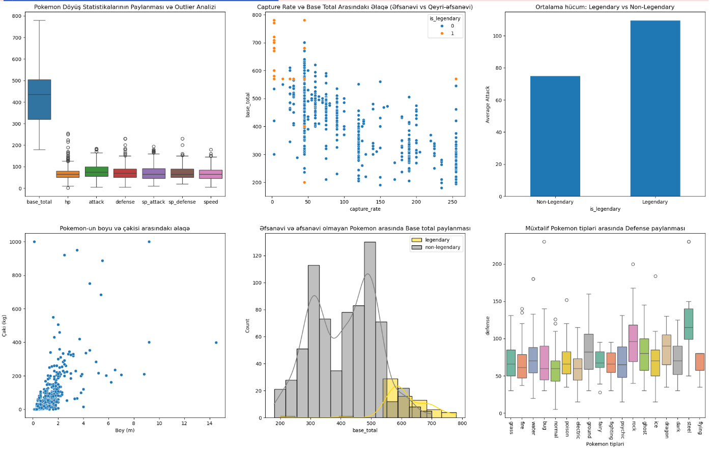

# Pokemon-Project
Pokemon dataset analysis and visualization using Python
## Project Overview

This project performs an **Exploratory Data Analysis (EDA)** on a dataset of **800+ Pokemon**.
Using Python data analysis and visualization tools, the goal is to explore Pokémon attributes and uncover relationships between key statistics such as attack, defense, speed, capture rate, and more.

---

## Objectives

The main objectives of this project are:

- Understand the distribution of Pokemon attributes  
- Identify correlations between variables  
- Compare Legendary vs Non-Legendary Pokemon  
- Analyze type-based differences  
- Create custom metrics for Pokemon strength  
- Build meaningful visualizations  
- Identify the strongest Pokemon based on statistical performance  

---

## Dataset Information

The dataset contains detailed Pokemon attributes:

| Column            | Description                     |
|------------------|---------------------------------|
| name             | Pokemon name                    |
| type1            | Primary type                    |
| type2            | Secondary type                  |
| base_total       | Total base stats                |
| hp               | Health points                   |
| attack           | Physical attack power           |
| defense          | Defensive strength              |
| sp_attack        | Special attack                  |
| sp_defense       | Special defense                 |
| speed            | Speed attribute                 |
| height_m         | Height in meters                |
| weight_kg        | Weight in kilograms             |
| is_legendary     | Legendary status                |
| generation       | Pokemon generation              |
| capture_rate     | Difficulty of catching          |
| base_happiness   | Friendship level                |
| percentage_male  | Male ratio                      |

---

## Technologies Used

- Python 
- Pandas (Data manipulation)  
- NumPy (Numerical computing)  
- Matplotlib (Data visualization)  
- Seaborn (Statistical visualization)  
- Jupyter Notebook  

---

## Key Insights

- **Strongest Pokémon:** Mewtwo is the most powerful Pokemon based on average combat stats.  
- **Legendary Advantage:** Legendary Pokemon have significantly higher attack power (+34.5 on average).  
- **Capture Difficulty:** Strong negative correlation (-0.71) between `base_total` and `capture_rate`.  
- **Most Common Type:** Water-type Pokemon dominate the dataset.  
- **Size Relationship:** Height and weight show a clear positive correlation.  
- **Gender Influence:** Male-dominant Pokemon have slightly higher average base stats (437.9 vs 426.1).  
- **Top Attacker:** Heracross is the strongest non-legendary physical attacker.  
- **Fastest Generation:** Generation 1 Pokemon have the highest average speed (70.15).  
- **Most Friendly Type:** Normal + Flying Pokemon have the highest total happiness score (1785).  
- **Best Defenders:** Steel-type Pokemon have the highest average defense (120.2).  

---

## Loading and Using the Dataset
To create an Excel file
df.to_excel('Pokemon.xlsx', index=False)

To create a CSV file
df.to_csv('Pokemon.csv', index=False)
